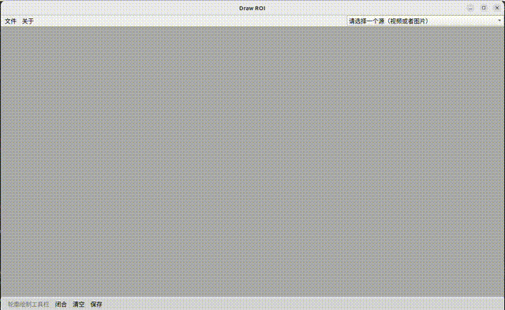

# ROI-Drawing-APP
Based on PyQT5; Drawing a ROI on frame. 一款基于PyQT5开发的ROI绘制小程序。

## How to Use:

   ### Direct Execution, No Configuration Required:

   Download from the release page: https://github.com/AICVHub/ROI-Drawing-APP/releases

   ### Source Code Execution, Environment Setup Required:

   - Python Environment:

     - PyQt5 5.15.10
     - PyQt5-Qt5 5.15.2
     - opencv-python-headless 4.10.0.84

## Software Usage Process:

1. Load Configuration: Select "Open/Change Configuration" from the "File" menu.
2. Select Source: Choose the required image or video stream from the configuration.
3. Draw ROI: Use the mouse to operate:
- Continue to click the left button to draw.
- Click the right button to close the contour.
- Click the middle button to clear the current contour.
4. Control Drawing Actions: Use the buttons on the toolbar to start, end, or clear drawing.